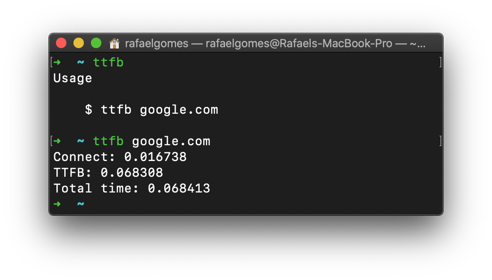

# TTFB Terminal

A easy way to check the TTFB via terminal

## Install

```bash
curl -s https://raw.githubusercontent.com/rafaelstz/ttfb-terminal/master/setup-ttfb
```

## Usage



2020 (c) [Rafael Corrêa Gomes](https://github.com/rafaelstz)